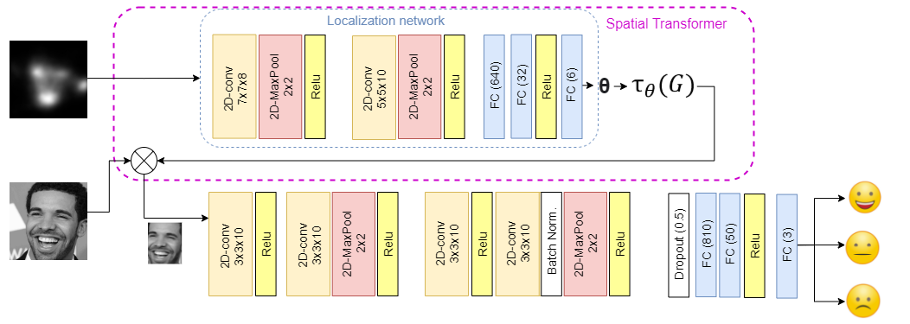
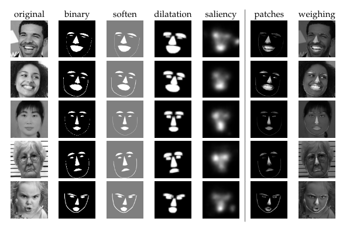
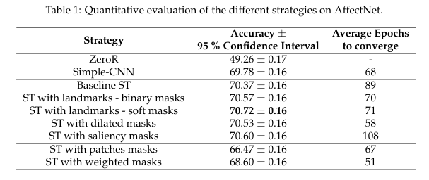
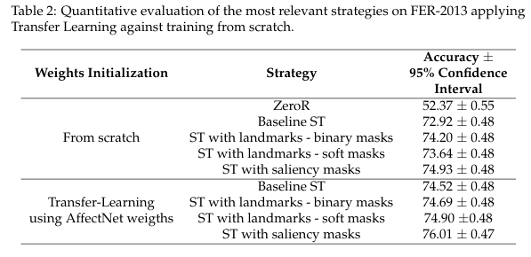

# Guided Spatial Transformers for Facial Expression Recognition
Repository to IMDB publication

In this repository, we implement the experiments performed in the paper: Guided Spatial Transformers for Facial Expression Recognition

## Installation
Download and install the following GitHub repository: 

    https://github.com/alexanderkroner/saliency

and include the files of the repository into: src/ImagePreprocessing/saliency
After downloading the files, create a new virtualenv and install the packages of this repository.

To install the other packages, create a new virtual environment and run:

    * pip install -r requirements.txt

** If problems installing grpcio, update pip version: pip3 install --upgrade pip

## Download datasets
For reproducing the experiments, firt you need to download the dataset used for the experiments: 

- [x] [FER-2013](https://www.kaggle.com/msambare/fer2013)
- [x] [AffectNet](http://mohammadmahoor.com/affectnet/)

Once downloaded, put them in your working directory, in what follows, we will refer to these directories as: 

* \<FER2013-dir> : Directory with the images of FER-2013 
* \<AffectNet-dir>: Directory with the images of AffectNet

## Prepare dataset (5 CV)
For replicating our results, we have uploaded the used dataset distribution to: data/datasets_distribution
In case you want to extract your own distributions, you can run the following code: 

    python3 src/DSpreparation/AffectNet_ds_processing.py -rt <AffectNet-dir>/Manually_Annotated_file_lists/training.csv
    -rv <AffectNet-dir>/Manually_Annotated_file_lists/validation.csv -o ~/Guided-EMO-SpatialTransformer/data/datasets_distribution/AffectNet
    -kf 5 -s 2020

Previous code, generates the default files to use the same cross-validation file for all the experiments. If we want to do the same for the 
FER-2013 dataset, we should run: 

    python3 src/DSpreparation/AffectNet_ds_processing.py -r ~/Guided-EMO-SpatialTransformer/data/datasets_distribution/FER2013/labels_FER2013.csv
    -o ~/Guided-EMO-SpatialTransformer/data/datasets_distribution/FER2013 -kf 5 -s 2020

## Arquitecture

The architecture used in this repo is an Spatial Transformer with a CNN, similar to the implemented in :https://github.com/omarsayed7/Deep-Emotion, but with some variations including Early stopping, cross-validation ... 

An image of the architecute appears below: 

## Prepare images
In the following picture you can see an example of each generated image: 

and below you have the code for generating them:

### Orginal images
First, we need to prepare the Datasets. 
For Affectnet, we apply a change in the format of some images (.bom, .tiff...) since the saliency extractor do not accept these formats. To do so, run: 

    python3 src/DSpreparation/prepare_AffectNet_imgs.py -r <AffectNet-dir>/Manually_Annotated_compressed/Manually_Annotated_Images
    -o <AffectNet-dir>/Manually_Annotated_Images_48x48_grayscale -imgSize 48python3 src/DSpreparation/prepare_AffectNet_imgs.py -r <AffectNet-dir> -o <output-dir-with-grayscaled-48x48-imgs> -imgSize 48

### Extract landmarks: 
To extract landmarks, run:  
    
AffectNet:

    python3 src/ImagePreprocessing/LandmarkExtractor.py -o <AffectNet-dir>/LANDMARKS_dlib_MTCNN -olandm <AffectNet-dir>/AFFECTNET/LANDMARKS_dlib_MTCNN_npy
    -d <AffectNet-dir>/Manually_Annotated_compressed/Manually_Annotated_Images -trainCSV ~/Guided-EMO-SpatialTransformer/data/datasets_distribution/AffectNet/polarity_complete_5folds.csv
    -trainCSVSep ; -ds AffectNet -logs <AffectNet-dir>/AFFECTNET

FER-2013:

    python3 src/ImagePreprocessing/LandmarkExtractor.py -o <FER2013-dir>/LANDMARKS_dlib_MTCNN -olandm <FER2013-dir>/LANDMARKS_dlib_MTCNN_npy
    -d <FER2013-dir>/IMAGES -trainCSV ~/Guided-EMO-SpatialTransformer/data/datasets_distribution/FER2013/labels_FER2013_31885KFOLDimgs.csv 
    -trainCSVSep ; -ds FER -logs <FER2013-dir>/logs_landmarks_extractor
    
 Convert to correct format: 

AffectNet:

    python3 src/DSpreparation/prepare_AffectNet_imgs.py -r <AffectNet-dir>/LANDMARKS_dlib_MTCNN -o <AffectNet-dir>/LANDMARKS_dlib_MTCNN_48x48_grayscale -imgSize 48

### Extract Soft Landmarks (L2):

    python3 src/ImagePreprocessing/prepare_L2_dilation_collage.py -r <AffectNet-dir>/Manually_Annotated_Images_48x48_grayscale -l <AffectNet-dir>/LANDMARKS_dlib_MTCNN_48x48_grayscale 
    -o <AffectNet-dir>/Soft_L2_48x48_grayscale -imgSize 48 -m soften -ds AffectNet

    python3 src/ImagePreprocessing/prepare_L2_dilation_collage.py -r <FER2013-dir>/IMAGES -l <FER2013-dir>/LANDMARKS_dlib_MTCNN
    -o <FER2013-dir>/Soft_L2_48x48_grayscale -imgSize 48 -m soften -ds FER

### Extract Dilation:

    python3 src/ImageProcessing/Landmarks-rmPartOfFace.py -r <AffectNet-dir>/Manually_Annotated_Images 
    -l <AffectNet-dir>/LANDMARKS_dlib_MTCNN_npy_PRUEBA -frm 'jaw' -o <AffectNet-dir>/LANDMARKS_NO_JAW

    python3 src/DSpreparation/prepare_AffectNet_imgs.py -r <AffectNet-dir>/LANDMARKS_NO_JAW 
    -o <AffectNet-dir>/LANDMARKS_NO_JAW_48x48_grayscale -imgSize 48

    python3 src/ImagePreprocessing/prepare_L2_dilation_collage.py -r <AffectNet-dir>/Manually_Annotated_compressed/Manually_Annotated_Images -l <AffectNet-dir>/LANDMARKS_NO_JAW_48x48_grayscale
    -o <AffectNet-dir>/Dilation -imgSize 48 -m dilation -ds AffectNet

### Extract saliency:
1. Change to the virtualenv where you installed the packages for extracting saliency
2. Run the following command:
   

    python3 src/ImagePreprocessing/saliency/main.py test -d salicon -p <AffectNet-dir>/Manually_Annotated_compressed/Manually_Annotated_Images/1 -o <AffectNet-dir>/SALIENCY -Ds AffectNet
   

    python3 src/ImagePreprocessing/saliency/main.py test -d salicon -p <FER2013-dir>/IMAGES -o <FER2013-dir>/SALIENCY -Ds FER2013

    * where PATH is the directory with the input images 
    * and OUT_PATH is the directory where you want to save the saliency of the images
    ** IMPORTANT: The original code does not include the -o option, check initial main in this repository to include this option

Convert to correct format: 

AffectNet:

    python3 src/DSpreparation/prepare_AffectNet_imgs.py -r <AffectNet-dir>/SALIENCY -o <AffectNet-dir>/SALIENCY_48x48_grayscale -imgSize 48

### Extract patches:

AffectNet:

    python3 src/ImageProcessing/prepare_L2_dilation_collage.py -r <AffectNet-dir>/Manually_Annotated_Images_48x48_grayscale 
    -l <AffectNet-dir>/landmarks_48x48_grayscale -o <AffectNet-dir>/patches_48x48_grayscale -imgSize 48 -m collage -ds AffectNet

### Extract weighted:
    
    python3 src/ImageProcessing/prepare_L2_dilation_collage.py -r <AffectNet-dir>/Manually_Annotated_Images_48x48_grayscale 
    -l <AffectNet-dir>/Soft_L2_48x48_grayscale -o <AffectNet-dir>/weighted_48x48_grayscale -imgSize 48 -m collage -ds AffectNet

## Train models (without Transfer Learning):
In this section, we summarize the parameters introduced to train the models in their different versions. 

### Baseline models: No spatial transformer version 

To train the original models (baseline) with a 5-folds cross-validation 
strategy and replicate our way to train the algorithms, run the following code (Notice that you need to complete the routes):

Affectnet: 

    python3 src/main_CV_Pytorch.py -kf 5 -d ../Guided-EMO-SpatialTransformer/data/datasets_distribution/AffectNet/polarity_complete_5folds.csv 
    -r <AffectNet-dir>/Manually_Annotated_Images_48x48_grayscale -imgSize 48 -e 500 -lr 0.001 -bs 128 -s 2020 -logs ../Guided-EMO-SpatialTransformer/data/AFFECTNET_LOGS -m baseline --train

FER-2013 (non-TL version):

    python3 src/main_CV_Pytorch.py -kf 5 -d ../Guided-EMO-SpatialTransformer/data/datasets_distribution/FER2013/labels_FER2013_31885KFOLDimgs.csv
    -r <FER2013-dir>/IMAGES -imgSize 48 -e 500 -lr 0.001 -bs 128 -s 2020 -logs ../Guided-EMO-SpatialTransformer/data/FER2013_logs -m baseline --train

### Original models + Original img through spatial attention layer
To train the original models (original version) with a 5-folds cross-validation, run:

    python3 src/main_CV_Pytorch.py -kf 5 -d ../Guided-EMO-SpatialTransformer/data/datasets_distribution/AffectNet/polarity_complete_5folds.csv 
    -r <AffectNet-dir>/Manually_Annotated_Images_48x48_grayscale -imgSize 48 -e 500 -lr 0.001 -bs 128 -s 2020 -logs ../Guided-EMO-SpatialTransformer/data/AFFECTNET_LOGS -m original --train
    

    python3 src/main_CV_Pytorch.py -kf 5 -d ../Guided-EMO-SpatialTransformer/data/datasets_distribution/FER2013/labels_FER2013_31885KFOLDimgs.csv
    -r <FER2013-dir>/IMAGES -imgSize 48 -e 500 -lr 0.001 -bs 128 -s 2020 -logs ../Guided-EMO-SpatialTransformer/data/FER2013_logs -m original --train

### ST-Landmarks models: Original img and Landmarks image to Spatial Transformer Network
To train the ST-Landmarks models with a 5-folds cross-validation, run:

    python3 src/main_CV_Pytorch.py -kf 5 -d ../Guided-EMO-SpatialTransformer/data/datasets_distribution/AffectNet/polarity_complete_5folds.csv 
    -r <AffectNet-dir>/Manually_Annotated_Images_48x48_grayscale -l <AffectNet-dir>/LANDMARKS_dlib_MTCNN_48x48_grayscale -imgSize 48 -e 500 
    -lr 0.001 -bs 128 -s 2020 -logs ../Guided-EMO-SpatialTransformer/data/AFFECTNET_LOGS -m landmarks --train
    

    python3 src/main_CV_Pytorch.py -kf 5 -d ../Guided-EMO-SpatialTransformer/data/datasets_distribution/FER2013/labels_FER2013_31885KFOLDimgs.csv 
    -r <FER2013-dir>/IMAGES -l <FER2013-dir>/LANDMARKS_dlib_MTCNN -imgSize 48 -e 500 
    -lr 0.001 -bs 128 -s 2020 -logs ../Guided-EMO-SpatialTransformer/data/FER2013_logs -m landmarks --train

### ST-Landmarks models (with white as saliency) : Original img and Landmarks (or saliency) image to Spatial Transformer Network
To train the ST-Landmarks models with a 5-folds cross-validation, run:

    python3 src/main_CV_Pytorch.py -kf 5 -d ../Guided-EMO-SpatialTransformer/data/datasets_distribution/AffectNet/polarity_complete_5folds.csv 
    -r <AffectNet-dir>/Manually_Annotated_Images_48x48_grayscale -l <AffectNet-dir>/LANDMARKS_dlib_MTCNN_48x48_grayscale -imgSize 48 -e 500 
    -lr 0.001 -bs 128 -s 2020 -logs ../Guided-EMO-SpatialTransformer/data/AFFECTNET_LOGS -m landmarks --train
    

    python3 src/main_CV_Pytorch.py -kf 5 -d ../Guided-EMO-SpatialTransformer/data/datasets_distribution/FER2013/labels_FER2013_31885KFOLDimgs.csv 
    -r <FER2013-dir>/IMAGES -l <FER2013-dir>/LANDMARKS_dlib_MTCNN -imgSize 48 -e 500 
    -lr 0.001 -bs 128 -s 2020 -logs ../Guided-EMO-SpatialTransformer/data/FER2013_logs -m landmarks --train

### ST-Soft Landmarks models (L2): Original img and Landmarks image to Spatial Transformer Network
To train the ST-Landmarks models with a 5-folds cross-validation, run:

    python3 src/main_CV_Pytorch.py -kf 5 -d ../Guided-EMO-SpatialTransformer/data/datasets_distribution/AffectNet/polarity_complete_5folds.csv 
    -r <AffectNet-dir>/Manually_Annotated_Images_48x48_grayscale -l <AffectNet-dir>/Soft_L2_48x48_grayscale -imgSize 48 -e 500 
    -lr 0.001 -bs 128 -s 2020 -logs ../Guided-EMO-SpatialTransformer/data/AFFECTNET_LOGS -m landmarks --train
    

    python3 src/main_CV_Pytorch.py -kf 5 -d ../Guided-EMO-SpatialTransformer/data/datasets_distribution/FER2013/labels_FER2013_31885KFOLDimgs.csv 
    -r <FER2013-dir>/IMAGES -l <FER2013-dir>/Soft_L2_48x48_grayscale -imgSize 48 -e 500 
    -lr 0.001 -bs 128 -s 2020 -logs ../Guided-EMO-SpatialTransformer/data/FER2013_logs -m landmarks --train

### ST-Dilation: Original img and Dilation image to Spatial Transformer Network
To train the ST-Landmarks models with a 5-folds cross-validation, run:

    python3 src/main_CV_Pytorch.py -kf 5 -d ../Guided-EMO-SpatialTransformer/data/datasets_distribution/AffectNet/polarity_complete_5folds.csv 
    -r <AffectNet-dir>/Manually_Annotated_Images_48x48_grayscale -l <AffectNet-dir>/Dilation_48x48_grayscale -imgSize 48 -e 500 
    -lr 0.001 -bs 128 -s 2020 -logs ../Guided-EMO-SpatialTransformer/data/AFFECTNET_LOGS -m landmarks 

### ST-Saliency models: Original img and Saliency image to Spatial Transformer Network
To train the ST-Saliency models with a 5-folds cross-validation, run:

    python3 src/main_CV_Pytorch.py -kf 5 -d ../Guided-EMO-SpatialTransformer/data/datasets_distribution/AffectNet/polarity_complete_5folds.csv 
    -r <AffectNet-dir>/Manually_Annotated_Images_48x48_grayscale -l <AffectNet-dir>/SALIENCY_48x48_grayscale -imgSize 48 -e 500 
    -lr 0.001 -bs 128 -s 2020 -logs ../Guided-EMO-SpatialTransformer/data/AFFECTNET_LOGS -m saliency --train
    

    python3 src/main_CV_Pytorch.py -kf 5 -d ../Guided-EMO-SpatialTransformer/data/datasets_distribution/FER2013/labels_FER2013_31885KFOLDimgs.csv 
    -r <FER2013-dir>/IMAGES -l <FER2013-dir>/SALIENCY -imgSize 48 -e 500 
    -lr 0.001 -bs 128 -s 2020 -logs ../Guided-EMO-SpatialTransformer/data/FER2013_logs -m saliency --train

## Train models (with Transfer Learning):
### Baseline models: No spatial transformer version 

FER-2013 (TL version):

    python3 src/main_CV_Pytorch.py -kf 5 -d ../Guided-EMO-SpatialTransformer/data/datasets_distribution/FER2013/labels_FER2013_31885KFOLDimgs.csv
    -r <FER2013-dir>/IMAGES -imgSize 48 -e 500 -lr 0.001 -bs 128 -s 2020 -logs ../Guided-EMO-SpatialTransformer/data/TL_FER2013_logs -m baseline 
    -tl ../Guided-EMO-SpatialTransformer/data/AFFECTNET_LOGS/1baseline_20210510_225930/trained_models/TMP-deep_emotion-500-128-0.001-COMPLETE-48-285-baseline.pt

### Original models + Original img through spatial attention layer
To train the original models (original version) with a 5-folds cross-validation, run:

    python3 src/main_CV_Pytorch.py -kf 5 -d ../Guided-EMO-SpatialTransformer/data/datasets_distribution/FER2013/labels_FER2013_31885KFOLDimgs.csv
    -r <FER2013-dir>/IMAGES -imgSize 48 -e 500 -lr 0.001 -bs 128 -s 2020 -logs ../Guided-EMO-SpatialTransformer/data/TL_FER2013_logs -m original
    -tl ../Guided-EMO-SpatialTransformer/data/AFFECTNET_LOGS/2original_20210510_160434/trained_models/TMP-deep_emotion-500-128-0.001-COMPLETE-48-241-original.pt

### ST-Landmarks models: Original img and Landmarks image to Spatial Transformer Network
To train the ST-Landmarks models with a 5-folds cross-validation, run:

    python3 src/main_CV_Pytorch.py -kf 5 -d ../Guided-EMO-SpatialTransformer/data/datasets_distribution/FER2013/labels_FER2013_31885KFOLDimgs.csv 
    -r <FER2013-dir>/IMAGES -l <FER2013-dir>/LANDMARKS_dlib_MTCNN -imgSize 48 -e 500 
    -lr 0.001 -bs 128 -s 2020 -logs ../Guided-EMO-SpatialTransformer/data/FER2013_logs -m landmarks
    -tl ../Guided-EMO-SpatialTransformer/data/AFFECTNET_LOGS/3landmarks/trained_models/TMP-deep_emotion-500-128-0.001-COMPLETE-48-90-landmarks.pt

### ST-Soft Landmarks models (L2): Original img and Landmarks image to Spatial Transformer Network
To train the ST-Landmarks models with a 5-folds cross-validation, run:

    python3 src/main_CV_Pytorch.py -kf 5 -d ../Guided-EMO-SpatialTransformer/data/datasets_distribution/FER2013/labels_FER2013_31885KFOLDimgs.csv 
    -r <FER2013-dir>/IMAGES -l <FER2013-dir>/Soft_L2_48x48_grayscale -imgSize 48 -e 500 
    -lr 0.001 -bs 128 -s 2020 -logs ../Guided-EMO-SpatialTransformer/data/FER2013_logs -m landmarks
    -tl ../Guided-EMO-SpatialTransformer/data/AFFECTNET_LOGS/4soft_landmL2/trained_models/TMP-deep_emotion-500-128-0.001-COMPLETE-48-111-landmarks.pt

### ST-Saliency models: Original img and Saliency image to Spatial Transformer Network
To train the ST-Saliency models with a 5-folds cross-validation, run:

    python3 src/main_CV_Pytorch_correctDropOut.py -kf 5 -d ../Guided-EMO-SpatialTransformer/data/datasets_distribution/FER2013/labels_FER2013_31885KFOLDimgs.csv 
    -r <FER2013-dir>/IMAGES -l <FER2013-dir>/SALIENCY -imgSize 48 -e 500 
    -lr 0.001 -bs 128 -s 2020 -logs ../Guided-EMO-SpatialTransformer/data/FER2013_logs -m saliency
    --tl ../Guided-EMO-SpatialTransformer/data/AFFECTNET_LOGS/6saliency_20210511_104116/trained_models/TMP-deep_emotion-500-128-0.001-COMPLETE-48-148-saliency.pt

## Results:

Results for valence recognition on AffectNet and FER-2013.

### Problems with images:

## FAQ

### How do I cite this work?
If you use the code of this work or the generated models, please cite the following paper:

{...}

### LICENSE:
...

### CONTACT:
If you have any question or you find a bug in the code, please contact us at: 

<cristina.lunaj@upm.es>

### OTHER:
* 103/29a31ebf1567693f4644c8ba3476ca9a72ee07fe67a5860d98707a0a.jpg -> Not included 

### Eval errors:
    python3 evaluate.py -d ../Guided-EMO-SpatialTransformer/data/datasets_distribution/AffectNet/polarity_complete_5folds.csv 
    -r <AffectNet-dir>/Manually_Annotated_Images_48x48_grayscale -l <AffectNet-dir>/Dilation_2iter -bs 128 
    -logs ../Guided-EMO-SpatialTransformer/data/error_analysis/AFFECTNET/5dilation_2x2_2iterat_noJaw 
    -m landmarks -tl ../Guided-EMO-SpatialTransformer/data/models_logs/AFFECTNET_LOGS/5dilation_2x2_2iterat_noJaw/trained_models
